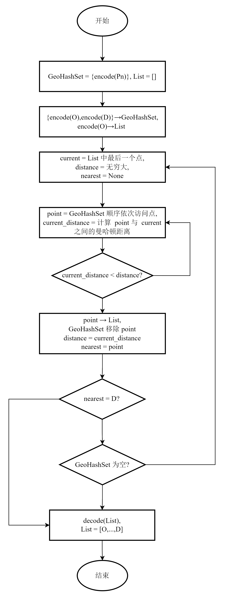

# 第三章 研究数据与方法
## 3.1 研究范围
(1)空间范围
上海是世界上共享单车投放量最大的城市之一
上海是中国经济最发达的城市之一，也是中国首批共享单车的投放地．截至 2017 年 9 月底，先后有 13 家公司在上海进行共享单车投放，投放总量超过 115 万量，注册的用户超过 500 万．在当时，共享单车投放量与使用量最大的企业是摩拜，大约投放了 67 万辆，约占比 58%，在共享单车的市场处于主导地位．
(2)时间范围

## 3.2 数据来源与预处理

### 3.2.1 数据来源与数据清洗
本文的研究数据包括骑行轨迹数据与上海市基本地理信息数据，其中骑行轨迹包括由互联网采集整理得到的 2016 年 8 月整月 102361 条上海市某品牌共享单车骑行轨迹数据及 2020 年 8 月整月 12793 条骑行记录，上海市基本地理信息数据包括由 Open  Street  Map 开源地理信息数据网站获取上海市路网矢与兴趣点分布矢量数据及由高德地图开放平台获取的上海市矢量边界数据。

2016 年骑行记录数据较为详细，除了常见的骑行起止时间及起止点位置字段外，还包含了一个以“#”分隔的骑行轨迹点集字段，但是由于网络延迟、设备故障等原因该字段内的轨迹点为乱序排列，需要设计算法以恢复正确的骑行轨迹（具体方法见 3.2.2），并且骑行实际距离也需要根据正确的轨迹数据计算（计算方法见 3.2.4）。2020 年骑行记录并未包含详细的骑行轨迹点集，但提供骑行距离。对于骑行记录数据，按照如下规则清洗：1）去除骑行时长小于1分钟大于 10 小时的骑行记录；2）对于有轨迹点集的数据，去除记录到的轨迹点数量小于 3 个的记录；3）去除存在字段缺失及异常符号的记录；4）去除骑行终点位于上海市之外的记录，该记录超出研究区域。

上海市基本地理信息数据的预处理使用 QGIS 软件处理，使用 QGIS 软件解析 Open  Street  Map 网站内部格式（ *.OSM ）的矢量数据将其转换为常用的 shapefile 文件格式( *.shp )并使用上海市矢量边界数据裁剪掉区域外的部分。

（补充路网及兴趣点地图 img3.2.1-1）

### 3.2.2 基于 Geohash 算法及曼哈顿距离的轨迹重排序算法
2008年 Gustavo Niemeyer 提出了 Geohash 地理编码系统[12]，它能将地理位置编码成由字母和数字组成的短字符串。Geohash 是一种多层级的空间数据结构，通过网格状的划分及 Z 形空间填充曲线 (Z-order curve)方式将空间进行编码。Geohash 编码精度可以通过增加编码字符长度无限拓展，同时可以通过去除编码末尾的字符来降低精度 (空间精度随之降低)。

由于其编码结构具有层级性，Geohash 保证了两个共享前缀越长的编码，其代表的地理位置越接近；由于其采用具有空间突变特性的 Z 形空间填充曲线，Geohash 无法保证距离很近的两个地理位置一定具有相同的编码前缀，且具有多位共享前缀的编码实际距离也有可能很远（多发生与边界处）。这种前缀匹配程度并不完全等同于地理距离的接近程度的现象被称为距离失真。

计算 Geohash 首先需要将经纬度坐标分别转换为二进制表示。然后按照“经度值占偶数位，纬度值占奇数位”的规则将经纬度交织为一个二进制串，最后使用 Base32 编码转换为字符串。Geohash 算法的计算过程可以概括为以下公式：

```
Geohash code = Base32(Interleave(Binary(longitude), Binary(latitude)))
```

其中，`Interleave` 函数表示经纬度二进制值的交织操作，`Base32` 函数表示二进制值转换为 Base32 编码的操作。

（补充 Geohash 流程图 img3.2.2-1）

曼哈顿距离由纽约市曼哈顿的棋盘式街道布局而得名，定义为两个点的坐标轴投影长度之。在二维平面上，两点 (x1, y1) 和 (x2, y2) 之间的曼哈顿距离为：
$$d(x, y) = |x_1 - y_1| + |x_2 - y_2|$$

考虑到轨迹点密度较高，相邻点之间的距离很短，且经纬度变化范围较小（绝大部分相邻点之间的经纬度跨度不超过0.001°），因此曼哈顿距离能够有效捕捉轨迹点的局部运动特征。且曼哈顿距离的计算公式简单，仅涉及绝对值运算，计算效率高。对于具有大量轨迹点的GPS数据，使用曼哈顿距离可以显著降低计算成本。因此，本算法通过计算两个坐标点之间的曼哈顿距离来判断两个点之间实际的空间距离。

| 经度 | 纬度 |
| -- | -- |
|121.347|31.392|
|121.348|31.389|
|121.349|31.390|
|121.350|31.390|
|121.351|31.390|
|121.351|31.391|
|121.352|31.391|
|121.353|31.391|
|121.353|31.394|
|121.354|31.391|
|121.355|31.391|
|121.356|31.389|
|121.356|31.390|
|121.356|31.391|
|121.357|31.388|
|121.357|31.389|

对于乱序轨迹点集，在知道始末点的前提下，本文提出了一种基于 Geohash 空间索引及曼哈顿距离及贪婪策略轨迹重排序算法:认为所有记录中的轨迹点集都是乱序状态，对于任意一轨迹点集，首先创建空列表 List 并将包含了起点和终点的所有点组成的列表 Pn 逐点计算 Geohash 编码并放入集合 GeoHash 中（该步骤同时借助集合的特性实现了去重复）。然后，循环迭代，直到轨迹点列表为空。在每次迭代中，算法会计算当前点与轨迹末尾点的曼哈顿距离，并找到距离最近的点。将最近点加入轨迹并从 GeoHash 集合中删除。如果找到终点，则算法终止。最后，将轨迹中的 GeoHash 编码转换为坐标并返回简化后的轨迹。




考虑到 Geohash 编码存在距离失真的问题，本算法首先使用 Geohash 编码筛选出一个候选点集，再通过计算曼哈顿距离估算实际距离。


### 3.2.3 使用 Haversine 算法计算骑行距离

## 3.3 研究方法

## 3.6 本章小结