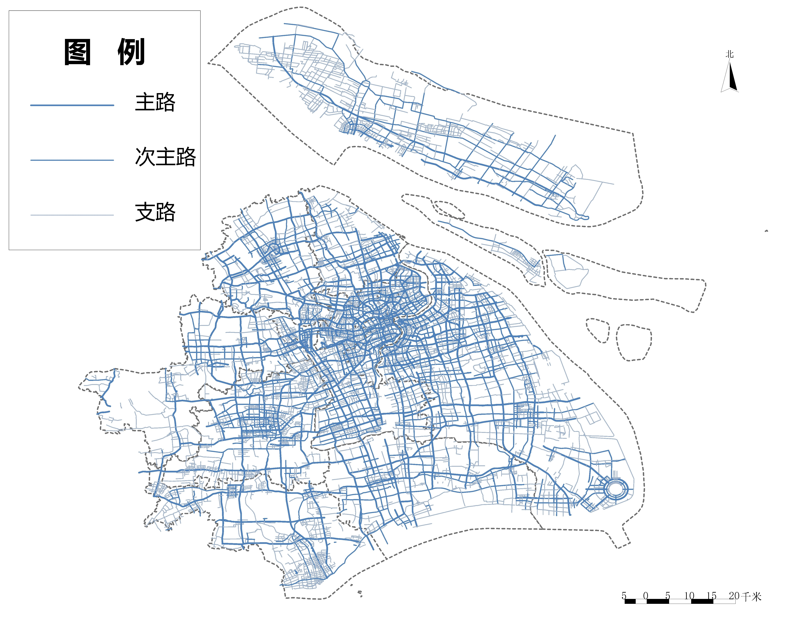
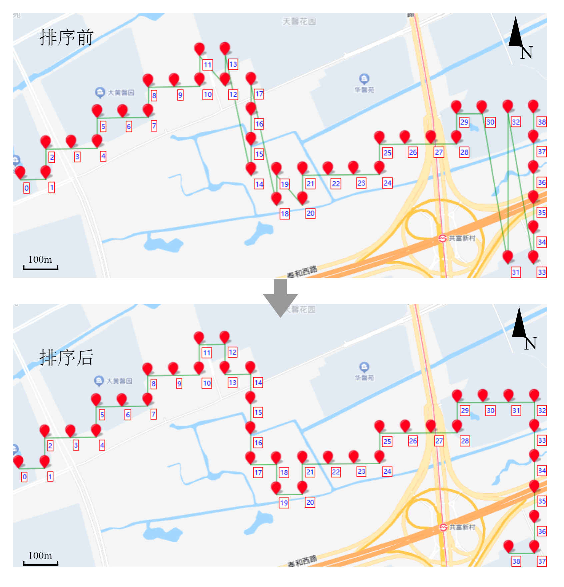

# 第三章 研究数据与方法
## 3.1 研究范围
本文选取上海市作为研究区域。上海市北界长江，南枕杭州湾，西接江浙两省，东临东海，全市面积 6340.5 平方公里，现辖16个市辖区：黄浦区、徐汇区、长宁区、静安区、普陀区、虹口区、杨浦区、闵行区、宝山区、嘉定区、浦东新、金山区、松江区、青浦区、奉贤区、崇明区。参考第七次全国人口普查主要数据，上海市常住人口为 24870895 人。近几十年来经济飞速发展的同时，上海市逐步形成了多中心、高人口密度及高混杂度的城市格局，这也进一步引起人口拥挤、交通拥堵和环境污染等大城市病。这些城市特征也同时存在于中国大多数大型、超大型城市中，选取作为中国经济中心的上海为研究区域具有一定的典型意及泛化意义。

## 3.2 数据来源与预处理

### 3.2.1 数据来源与数据清洗
本文的研究数据包括骑行轨迹数据与上海市基本地理信息数据，其中骑行轨迹包括由互联网采集整理得到的 2016 年 8 月整月 102361 条上海市某品牌共享单车骑行轨迹数据及 2020 年 8 月整月 12793 条骑行记录，上海市基本地理信息数据包括由 Open  Street  Map 开源地理信息数据网站获取上海市路网矢与兴趣点分布矢量数据及由高德地图开放平台获取的上海市矢量边界数据。

2016 年骑行记录数据较为详细，除了常见的骑行起止时间及起止点位置字段外，还包含了一个以“#”分隔的骑行轨迹点集字段，但是由于网络延迟、设备故障等原因该字段内的轨迹点为乱序排列，需要设计算法以恢复正确的骑行轨迹（具体方法见 3.2.2），并且骑行实际距离也需要根据正确的轨迹数据计算（计算方法见 3.2.4）。2020 年骑行记录并未包含详细的骑行轨迹点集，但提供骑行距离。对于骑行记录数据，按照如下规则清洗：1）去除骑行时长小于1分钟大于 8 小时的骑行记录；2）对于有轨迹点集的数据，去除记录到的轨迹点数量小于 3 个的记录；3）去除存在字段缺失及异常符号的记录；4）去除骑行终点位于上海市之外的记录，该记录超出研究区域。

| 字段 | 说明 | 字段值 |
| -- | -- | -- |
| ID | 编号 | 1 |
| BID | 单车编号 | 79699 | 
| UID | 用户编号 | 759 |
| ST | 开始时间 | 2016/8/1 0:23 |	
| SX | 起点经度 | 121.520 |	
| SY | 起点纬度 | 31.309 |	
| ET | 结束时长 | 2016/8/1 0:32 |	
| DU | 骑行时间 | 9 |	
| EX | 终点经度 | 121.525 |	
| EY | 终点纬度 | 31.316 |		
| WD | 星期 | 星期一 |		
| track | 轨迹点 | 121.520,31.309#... |

> 注：轨迹点并不按照骑行时间排列，存在乱序点及定位异常点，需要算法处理。

上海市基本地理信息数据的预处理使用 QGIS 软件处理，使用 QGIS 软件解析 Open  Street  Map 网站内部格式（ *.OSM ）的矢量数据将其转换为常用的 shapefile 文件格式( *.shp )并使用上海市矢量边界数据裁剪掉区域外的部分。从上海市路网数据集中抽取出五个级别道路（主路、次主路、支路、骑行道路、人行道）共计 46445 条数据。

从上海市兴趣点数据集中抽取出八个类别的兴趣点集（交通设施服务、体育休闲服务、公司企业、商务住宅、科教文化服务、购物服务、风景名胜、餐饮服务）共计 122608 条数据。

### 3.2.2 轨迹重排序及长度量测
2008年 Gustavo Niemeyer 提出了 GeoHash 地理编码系统[20]，它能将地理位置编码成由字母和数字组成的短字符串。GeoHash 是一种多层级的空间数据结构，通过网格状的划分及 Z 形空间填充曲线 (Z-order curve)方式将空间进行编码。GeoHash 编码精度可以通过增加编码字符长度无限拓展，同时可以通过去除编码末尾的字符来降低精度 (空间精度随之降低)。

由于其编码结构具有层级性，GeoHash 保证了两个共享前缀越长的编码，其代表的地理位置越接近；由于其采用具有空间突变特性的 Z 形空间填充曲线，GeoHash 无法保证距离很近的两个地理位置一定具有相同的编码前缀，且具有多位共享前缀的编码实际距离也有可能很远（多发生与边界处）。这种前缀匹配程度并不完全等同于地理距离的接近程度的现象被称为距离失真。

计算 GeoHash 首先需要将经纬度坐标分别转换为二进制表示。然后按照“经度值占偶数位，纬度值占奇数位”的规则将经纬度交织为一个二进制串，最后使用 Base32 编码转换为字符串。GeoHash 算法的计算过程可以概括为以下公式：

$$GeoHash(lon, lat) = Base32(Interleave(Binary(lon), Binary(lat)))$$

其中，`Interleave` 函数表示经纬度二进制值的交织操作，`Base32` 函数表示二进制值转换为 Base32 编码的操作。

曼哈顿距离由纽约市曼哈顿的棋盘式街道布局而得名，定义为两个点的坐标轴投影长度之。在二维平面上，两点 (x1, y1) 和 (x2, y2) 之间的曼哈顿距离为：

$$d(x, y) = |x_1 - y_1| + |x_2 - y_2|$$

考虑到轨迹点密度较高，相邻点之间的距离很短，且经纬度变化范围较小（绝大部分相邻点之间的经纬度跨度不超过0.001°），因此曼哈顿距离能够有效捕捉轨迹点的局部运动特征。且曼哈顿距离的计算公式简单，仅涉及绝对值运算，计算效率高。对于具有大量轨迹点的GPS数据，使用曼哈顿距离可以显著降低计算成本。因此，本算法通过计算两个坐标点之间的曼哈顿距离来判断两个点之间实际的空间距离。

| 经度 | 纬度 |
| -- | -- |
|121.347|31.392|
|121.348|31.389|
|121.349|31.390|
|121.350|31.390|
| ... | ... |

对于乱序轨迹点集，在知道始末点的前提下，本文提出了一种基于 GeoHash 空间索引及曼哈顿距离及贪婪策略轨迹重排序算法:认为所有记录中的轨迹点集都是乱序状态，对于任意一轨迹点集，首先创建空列表 List 并将包含了起点和终点的所有点组成的列表 Pn 逐点计算 GeoHash 编码并放入集合 GeoHash 中（该步骤同时借助集合的特性实现了去重复）。然后，循环迭代，直到轨迹点列表为空。在每次迭代中，算法会计算当前点与轨迹末尾点的曼哈顿距离，并找到距离最近的点。如果找到的最近点就是终点，则算法终止，否则将最近点加入轨迹并从 GeoHash 集合中删除。最后，将轨迹列表 List 中的 GeoHash 编码转换为坐标并返回简化后的轨迹。

由于 Python 编程语言的集合（Set）原生的散列值计算函数作用于元组（tuple）类型的数据时会发生二进制精度损失，所以需要首先使用 GeoHash 算法对位置元组进行编码（encode）再将得到的字符串存入集合中，在需要用到实际坐标时再使用对应的解码方法（decode），这样可以规避使用存入及去除集合时由于散列值计算带来的精度损失。考虑到 GeoHash 编码存在距离失真的问题，本算法使用两经纬度坐标间的曼哈顿距离来估算实际距离。以下是对某一真实路径进行排序的实际效果：

假设地球是一个球体，球面半径为 r（取 6371000 米），用经度 lon 和纬度 lat 表示球面上的点，则在已知有序骑行轨迹 n 个点组成的列表($List = [(lon1, lat1), (lon2, lat2), \cdots, (lonn, latn)]$)的情况下，可以使用 Haversine 算法计算得每字轨迹的长度再累加得总轨迹长度。

$$d = \sum_{i=1}^{n-1} 2r \arcsin(\sqrt{\sin^2(\frac{lat_{i+1} - lat_i}{2}) + \cos(lat_i) \cos(lat_{i+1}) \sin^2(\frac{lon_{i+1} - lon_i}{2})})$$

使用上述方法对一段轨迹进行处理，计算得轨迹起点与终点间的直接半正弦距离为 2118.25 米，未排序轨迹点集的累计半正弦距离（认为地球半径为 6371000 米）为 8685.89 米，经过算法重排序后的累计半正弦距离为 3605.04 米。可以发现，由于未经处理的轨迹点集中存在部分不合理的乱序点，导致轨迹总长度明显偏大，经算法重排序后的轨迹点集较为合理。在中央处理器为 i7-10870H，机带RAM 16GB 的 Windows11 笔记本上，使用该算法处理十万条轨迹数据总耗时约1小时31分。

## 3.3 研究方法

### 3.3.1 

### 3.3.2 

## 3.4 本章小结
