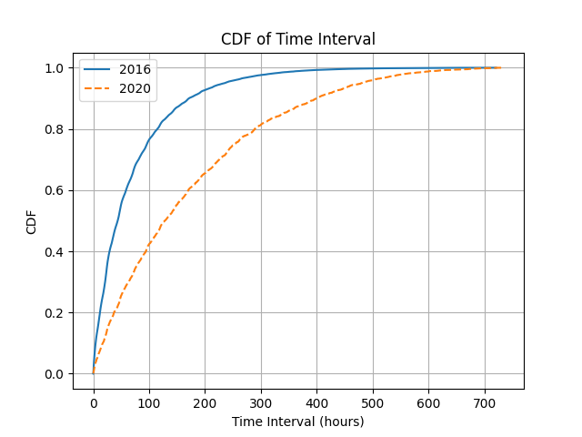

# 第四章 结果与讨论
## 4.1 时间通勤模式分析

### 4.1.1 通勤时距模式
（第一部分 骑行时间柱状图 骑行距离柱状图）

对共享单车通勤时段进行汇总分析，研究不同工作日一天二十四小时不同时段的通勤规律。首先将骑行数据的开始时间按照工作日分组汇总，再对每一个工作日按二十四小时统计每一个小时内的订单数量，最后将每个小时的订单数量除以当前工作日的总订单数量，得到每个小时的订单占比。分别对2016年及2020年的骑行数据进行汇总，可以得到如下统计图，结合该统计图可以探究上海市一周七天每天二十四小时内的订单数量分布。

2016年工作日骑行具有明显的早晚高峰特征，早高峰集中在8:00至9:00，晚高峰则以16:00至17:00较为突出，与用户工作日上班、上学等通勤需求贴合。周末骑行曲线总体平缓，且8:00至15:00总体高于工作日，其中16:00至19:00呈现出一个平滑单峰，这样的分布与用户周末休闲放松需求相符合。

2020年工作日骑行时段分布较为不同，其中周一、周二、周三及周末呈现出明显的早晚高峰特征，而周四及周五呈现出类似于2016年周末的平缓单峰特征。并且，周末的早高峰强度甚至大于一般工作日。这种现象与当时新冠疫情防控政策有关，当时某些企业采取居家办公或弹性工作策略，学校也有一定的网络授课安排。另外，大规模核酸检测也会造成非一般的使用时段分布，一些人可能为了不影响工作日正常上班，而选择在周末上午做核算。

### 4.1.1 通勤间隔分析
间隔，指的是用户的相同行为之间的时间间隔长度，例如用户两次登陆账号的时间间隔等。用户骑行共享单车通勤通常是一种重复性动作，同一用户两次骑行之间的时间间隔可以有效反映使用者的行为习惯。间隔分析就是在研究大量个体用户骑行时间间隔特征的基础上，汇总出总体用户间隔的概率分布并把握宏观用户行为模式的一种研究方法。

用户骑行数据中有用于区分单个用户的编号（UID）及用户开始骑行的时间戳（ST），通过筛选用户编号再顺序求取两次骑行时间戳之间的差值即可获得用户骑行间隔，可以将所有用户的骑行间隔汇总至一个代表了整体用户行为模式的超级用户中。对于单个用户，可以采用如下公式计算骑行间隔：

$$ i = [t_2 - t_1, t_3 - t_2, ..., t_n - t_{n-1}] $$

可以将超级用户的骑行间隔数据记录为：

$$ I = [i_1, i_2, ..., i_n] $$
其中，$i$为用户骑行间隔时间，$n$为用户骑行次数。

对汇总了所有用户骑行间隔的超级用户，我们可以使用累积分布函数（Cumulative Distribution Function, CDF）来描述用户骑行间隔的分布情况。累计分布函数是一个在[0,1]区间上的单调非减函数，数学定义如下：

$$ F_{X}(x) = P(X \leq x) $$

在计算机中可以使用如下公式估算CDF：

$$ F_{X}(x) = \frac{1}{n} \sum_{i=1}^{n} I_i \leq x $$

分别汇总计算2016年和2020年上海共享单车用户两次骑行之间间隔的累计分布曲线：

2016年和2020年的两次骑行间隔分布总体相似，数据相对集中于短间隔方向（ 间隔 300 小时以下 ），这也意味着大部分用户频繁使用共享单车，两次骑行间隔较短，多用于日常通勤。

2016年的累计分布曲线在 200 小时（约间隔 8 天）处具有明显拐点，数据相对集中于该拐点左侧，呈现出明显的短间隔高频特征，即多数用户一周内要多次骑行共享单车。2020年所有时间间隔的CDF值都小于2016年，这意味着在2020年，用户两次骑行之间的间隔时间总体上比2016年长，考虑到此时处于疫情期间，人们的出行需求受到一定程度的抑制。但是，2020年的曲线没有明显拐点，呈现出一种平缓增加的特征，这说明2020年的两次骑行间隔分布相比2016年更加分散，用户骑行共享单车的通勤模式更为多元，共享单车逐渐为更多人所接受。

## 4.2 空间通勤模式分析

### 4.2.1 通勤目的地分析

骑行作为一种便捷的出行方式，其终点位置往往能够反映骑行者的行为目的。例如，如果骑行终点位于商场附近，则可以推断骑行者可能打算去购物；如果骑行终点位于交通设施附近，例如公交车站台或地铁站，则可以推断共享单车的活动半径可能无法满足骑行者的通勤需求；如果骑行终点位于体育馆或公园附近，则可以推断骑行者可能打算进行体育锻炼或休闲放松。

使用本文提出的骑行终点最近邻匹配算法（3.3.1），可以将骑行终点匹配到最近的兴趣点类别，推断骑行者的行为目的。通过对2016年和2020年的骑行数据进行分析，可以得到如下统计图：

2016年与2020年骑行目的地总体相似，购物服务、交通设施服务和餐饮服务为主要目的地，占比近六成，反映了上海市商业活动活跃、交通发达、生活便利的特点。科教文化服务、商务住宅和公司企业也是较多用户的选择，占比近三成，表明上海市拥有较多较密集的院校及企业。风景名胜和体育休闲服务占比最少，可能与人口密集、生活压力大有关。

2016年至2020年，上海市骑行目的地总体呈现出“三升一降、两稳”的趋势: 1）购物服务、餐饮服务和商务住宅类目的地数量有所增长，分别增长了0.7%、0.5%和0.1%。 这表明该区域的商业活动、餐饮需求和商务氛围有所增强，可能是由于经济发展、居民收入水平提高、消费观念转变等因素导致。2）交通设施服务、公司企业和科教文化服务类目的地数量保持稳定，占比变化不大。 这说明该区域的交通基础设施、商务环境和文化氛围相对稳定，共享单车已经成为人们日常通勤的重要交通工具3）风景名胜类目的地数量略有下降，占比下降了0.1%。 这表明该区域的旅游资源开发需要进一步加强。

总体而言，2016年至2020年上海市骑行目的地变化趋势反映了该区域经济社会发展的变化。未来可以考虑加强旅游资源开发、优化商业布局、提升城市宜居性，为市民提供更加丰富多彩的骑行体验。

### 4.2.2 

## 4.4 本章小结
