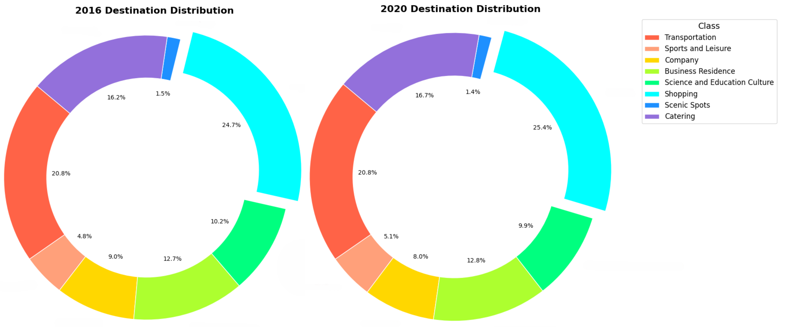
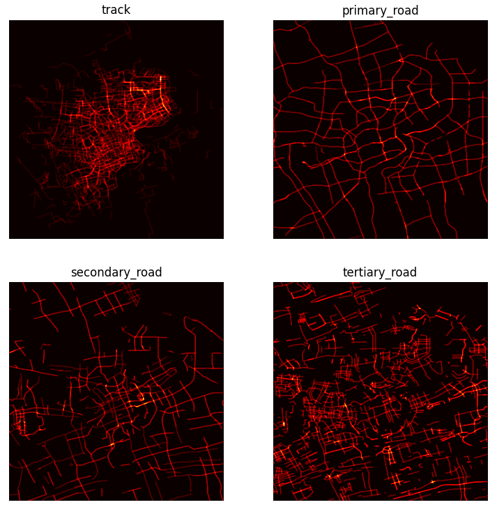
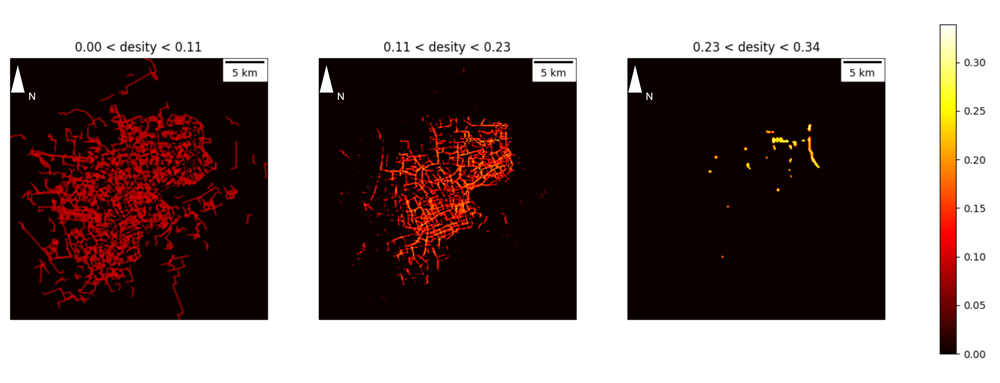
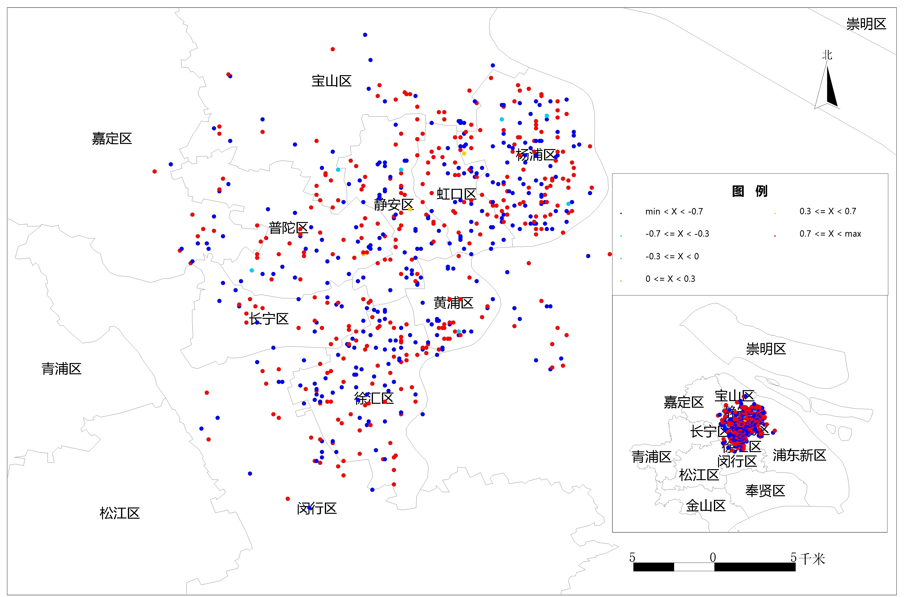
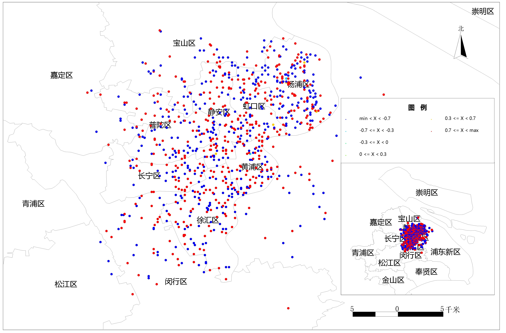

# 第四章 结果与讨论
## 4.1 时间通勤模式分析

### 4.1.1 通勤时距模式
对共享单车通勤时长进行汇总分析，计算得每一个骑行时长区间内的频率，并拟合出正态分布曲线。频率直方图显示数据的直观频率分布情况，拟合得出的正态分布曲线显示数据趋势及统计学分布。可以发现，共享单车平均通勤时长为16分钟，骑行时长8分钟频率最高，极少有人选择骑行一个小时以上。对比2016年与2020年数据，总体分布及趋势保持稳定，骑行平均时长略有下降。共享单车在多数情况下还是一种短途、短时间的通勤工具。

对共享单车通勤距离进行汇总分析，绘制出频率分布直方图及对应的拟合正态分布曲线，可以发现2016年平均骑行距离为1.8公里，而2020年平均骑行距离仅为1.4公里。2020年数据高度集中在小于1公里的范围内，数据标准差更小，分布也更为紧凑，0.8公里左右的短途骑行成为最多人的选择。说明人们越来与认可单车是解决“最后一公里”通勤问题的有效交通工具，共享单车市场也逐步积累了一批有稳定短途通勤需求的用户群体。

共享单车的通勤时距模式分析表明，其使用场景十分典型，符合推广期宣传的短途、快速、方便等特点。

对共享单车通勤时段进行汇总分析，研究不同工作日一天二十四小时不同时段的通勤规律。首先将骑行数据的开始时间按照工作日分组汇总，再对每一个工作日按二十四小时统计每一个小时内的订单数量，最后将每个小时的订单数量除以当前工作日的总订单数量，得到每个小时的订单占比。分别对2016年及2020年的骑行数据进行汇总，可以得到如下统计图，结合该统计图可以探究上海市一周七天每天二十四小时内的订单数量分布。

2016年工作日骑行具有明显的早晚高峰特征，早高峰集中在8:00至9:00，晚高峰则以16:00至17:00较为突出，与用户工作日上班、上学等通勤需求贴合。周末骑行曲线总体平缓，且8:00至15:00总体高于工作日，其中16:00至19:00呈现出一个平滑单峰，这样的分布与用户周末休闲放松需求相符合。

2020年工作日骑行时段分布较为不同，其中周一、周二、周三及周末呈现出明显的早晚高峰特征，而周四及周五呈现出类似于2016年周末的平缓单峰特征。并且，周末的早高峰强度甚至大于一般工作日。这种现象与当时新冠疫情防控政策有关，当时某些企业采取居家办公或弹性工作策略，学校也有一定的网络授课安排。另外，大规模核酸检测也会造成非一般的使用时段分布，一些人可能为了不影响工作日正常上班，而选择在周末上午做核酸检测。

### 4.1.2 通勤间隔分析
间隔，指的是用户的相同行为之间的时间间隔长度，例如用户两次登陆账号的时间间隔等。用户骑行共享单车通勤通常是一种重复性动作，同一用户两次骑行之间的时间间隔可以有效反映使用者的行为习惯。间隔分析就是在研究大量个体用户骑行时间间隔特征的基础上，汇总出总体用户间隔的概率分布并把握宏观用户行为模式的一种研究方法。

用户骑行数据中有用于区分单个用户的编号（UID）及用户开始骑行的时间戳（ST），通过筛选用户编号再顺序求取两次骑行时间戳之间的差值即可获得用户骑行间隔，可以将所有用户的骑行间隔汇总至一个代表了整体用户行为模式的超级用户中。对于单个用户，可以采用如下公式计算骑行间隔：

$$ i = [t_2 - t_1, t_3 - t_2, ..., t_n - t_{n-1}] $$

可以将超级用户的骑行间隔数据记录为：

$$ I = [i_1, i_2, ..., i_n] $$
其中，$i$为用户骑行间隔时间，$n$为用户骑行次数。

对汇总了所有用户骑行间隔的超级用户，我们可以使用累积分布函数（Cumulative Distribution Function, CDF）来描述用户骑行间隔的分布情况。累计分布函数是一个在[0,1]区间上的单调非减函数，数学定义如下：

$$ F_{X}(x) = P(X \leq x) $$

在计算机中可以使用如下公式估算CDF：

$$ F_{X}(x) = \frac{1}{n} \sum_{i=1}^{n} I_i \leq x $$

分别汇总计算2016年和2020年上海共享单车用户两次骑行之间间隔的累计分布曲线：

2016年和2020年的两次骑行间隔分布总体相似，数据相对集中于短间隔方向（ 间隔 300 小时以下 ），这也意味着大部分用户频繁使用共享单车，两次骑行间隔较短，多用于日常通勤。

2016年的累计分布曲线在 200 小时（约间隔 8 天）处具有明显拐点，数据相对集中于该拐点左侧，呈现出明显的短间隔高频特征，即多数用户一周内要多次骑行共享单车。2020年所有时间间隔的CDF值都小于2016年，这意味着在2020年，用户两次骑行之间的间隔时间总体上比2016年长，考虑到此时处于疫情期间，人们的出行需求受到一定程度的抑制。但是，2020年的曲线没有明显拐点，呈现出一种平缓增加的特征，这说明2020年的两次骑行间隔分布相比2016年更加分散，用户骑行共享单车的通勤模式更为多元，共享单车逐渐为更多人所接受。
### 4.1.3 单车周转率
周转率原本是一个企业管理中的指标，用来衡量企业资产的使用效率。在共享单车的应用中，我们可以将共享单车的周转率定义为单位时间内单车的使用次数。周转率越高，说明单车的使用频率越高，需求越旺盛。在共享单车的运营中，周转率可以用来衡量共享单车的使用效率，以及共享单车的使用需求。在某一特定时间窗口内，单车周转率具体定义为该时间窗口内总订单数与该时间窗口内提供服务的不重复单车总数之比。
$$ Turnover Rate = \frac{Total Orders}{Total Bikes} $$

现对轨迹数据统计日周转率如下图：

从总体趋势上来看，由月首至月尾，日周转率均呈现下降趋势，总体波动趋势相近，2020年曲线呈现约三天的迟滞。观察到2016年及2020年均存在三至四个较为明显的周转率尖峰，几乎呈现七天等距分布，并逐步降低。这暗示了共享单车周转状况存在一定的的周内特征，故统计一周七个工作日的周转率状况，绘制为下图：

可以发现二者总体趋势相当，工作日日周转率随周一到周日逐步下降，该规律也与日周转率变化相符合。从日周转率来看，高位往往出现在周一、周二、周六及周日，低位一般出现在周三至周五。单车周转率可以从一定程度上反映共享单车企业调度策略及用户通勤需求，通过分析周转率变化，可以帮助企业优化调度策略。由于获取的数据仅为总体骑行数据的部分样本，计算出的周转率会有一定的偏差，但是通过观察其变化趋势仍能发现一定规律。

## 4.2 空间通勤模式分析

### 4.2.1 通勤目的地分析

骑行作为一种便捷的出行方式，其终点位置往往能够反映骑行者的通勤目的。例如，若骑行终点位于商场附近，则可推断骑行者打算去购物；若骑行终点位于交通设施附近（公交车站台或地铁站），则可推断该骑行者有更远的通勤目的地需要换乘其他交通工具；若骑行终点位于体育馆或公园附近，则可推断骑行者准备从事一些放松休闲活动。

使用本文提出的骑行终点最近邻匹配算法（3.3.2），可以将骑行终点匹配到最近的兴趣点类别，推断骑行者的行为目的。通过对2016年和2020年的骑行数据进行分析，可以得到如下统计图：

2016年与2020年骑行目的地总体相似，购物服务、交通设施服务和餐饮服务为主要目的地，占比近六成，反映了上海市商业活动活跃、交通发达、生活便利的特点。科教文化服务、商务住宅和公司企业也是较多用户的选择，占比近三成，表明上海市拥有较多较密集的院校及企业。风景名胜和体育休闲服务占比最少，可能与人口密集、生活压力大有关。

2016年至2020年，上海市骑行目的地总体呈现出“三升一降、两稳”的趋势: 1）购物服务、餐饮服务和商务住宅类目的地数量有所增长，分别增长了0.7%、0.5%和0.1%。 这表明该区域的商业活动、餐饮需求和商务氛围有所增强，可能是由于经济发展、居民收入水平提高、消费观念转变等因素导致。2）交通设施服务、公司企业和科教文化服务类目的地数量保持稳定，占比变化不大。 这说明该区域的交通基础设施、商务环境和文化氛围相对稳定，共享单车已经成为人们日常通勤的重要交通工具3）风景名胜类目的地数量略有下降，占比下降了0.1%。 这表明该区域的旅游资源开发需要进一步加强。

通过提取骑行轨迹终点并绘制热力图，我们可以研究上海市共享单车通勤目的地的空间分布模式。结果表明，通勤目的地热点主要沿交通干线分布，呈现连珠状分布，且主要集中在杨浦区。热点区域主要沿逸仙路、共和新路、四平路等路段分布。对比2016年与2020年数据，发现热点区域沿交通干线呈连珠状分布的分布模式保持稳定，但2020年骑行热度总体下降。这表明，共享单车主要还是一种短途中继通勤工具。一般商业设施、交通站点多沿主城区交通干线分布，骑行目的地主要为购物服务及交通设施，也印证了这一观点。

总体而言，2016年及2020年上海市骑行目的地组成及分布，可以发现该地区商业资源丰富且分散，居民购物、餐饮需求较为旺盛。交通基础设施发达，生活便利，并且共享单车很好地起到了补充作用。

### 4.2.2 通勤轨迹分析
考虑到工作日通勤轨迹具有相似性，本文选取2016年8月1日（星期一）全天上海市共享单车轨迹数据做详细分析，该数据已预先使轨迹重排序（3.2.2）及道格拉斯-扑克法（3.2.3，阈值为0.0015）处理过。观察到抽稀后轨迹数据粗略呈束状沿道路分布，故采用空间线密度算法轨迹数据进行处理，得到线密度栅格（分辨率约为100m*100m）。为了探究骑行轨迹数据与各级别路网数据之间的关系，首先使用轨迹格网边界矩形裁剪三级路网数据（主路、次主路、支路），再以与轨迹线密度栅格相同的分辨率计算各级路网的线密度栅格。

<!-- 待修改 5.17 修改 5.19-->
线密度栅格反映了一定空间区域内线数据的密集程度，这对于统计骑行轨迹数据的空间分布具有重要意义。根据计算出的骑行轨迹线密度栅格值分布，划分为三个层级，分别为低密度（密度大于0小于0.11），中密度（密度大于0.11小于0.23）及高密度（密度大于0.23小于0.34）。为了使线形更加清晰，并保持一定的连续性，对数据做了结构核元素大小为3*3的开运算操作。

选取高密度（密度大于0.23小于0.34）骑行轨迹线密度栅格，控制图层透明度为50%与底图叠加制图。可以发现高密度骑行区域多呈现线性区域，且与研究区域东北方向的一些路段相吻合，偶有团块状区域，往往与交叉路口重合。具体来说，最长且骑行密度最高的路段，起于殷行路与中原路交汇点，经中原路-营口路-隆昌路，止于隆昌路与长阳路交汇点。该路段穿过国和居民区，串联起上海体育学院、东方肝胆医院、名星社区、黄兴公园及杨浦公园等。另一骑行热点路段起于逸仙高架路与政立路交汇点，经政立路止于政立路与国和路交汇点，该路段刚好为上海财经大学临街路段。还零星分布有若干团块状骑行热点，这些热点路段大多分布在以五角场为中心的大致50平方公里的区域内，考虑到该区域高等院校林立，足以见得，高校密集具有极其旺盛的骑行通勤需求。

选取中密度层级栅格与路网矢量数据叠加制图，图中蓝色代表栅格背景色，绿色代表一般密集区域，黄色代表中等密集区域，红色代表高度密集区域。可以发现骑行轨迹线密度栅格大体上与路网重叠，部分区域因栅格化精度问题存在一到两个格网的偏差。大部分线状骑行轨迹栅格条块沿自身长轴断续存在高度密度路段，尤其易于在路段交汇处出现。少数路段存在连续的高密度栅格分布：政立路（1）、周家嘴路（2）、宜山路及柳州路（3）。还存成团、块、环状分布的高密度栅格区域：黄陵坡路-陆家浜路-河南南路-延安东路所围成的地块（4）、宁夏路-凯旋路-长宁路-曹杨路所组成的环状路（5）。其中，政立路路段位于学校密集区域，沿途分布有上海体育学院宿舍群、上海财经大学教学及宿舍区域以及其他几所小学初中；周家嘴路位于产业密集区域，沿途分布有许多汽修、电子、钢材及汽车用品厂区；宜山路及柳州路位于居住密集区域，周围分布高密度住宅楼；对于团、块、环状高密度栅格区域，黄陵坡路-陆家浜路-河南南路-延安东路所围成的地块为住宅密集区域，其中夹杂分布着幼儿园、小学等学校区域；宁夏路-凯旋路-长宁路-曹杨路所组成的环状路内部分布有上海中山公园及大片的住宅区，苏州河也流经这片区域。

计算骑行轨迹线密度与各级别道路的线密度栅格之间的Jaccard相似系数，得到如下表格：

| 道路等级 | Jaccard相似系数 |
| :---: | :---: |
| 主路 | 13.21% |
| 次主路 | 14.00% |
| 支路 | 17.55% |

可以发现，骑行轨迹线密度栅格与支路线密度栅格的相似系数最高，次主路次之，主路最低。

为了考察各级路网对骑行通勤的支撑状况，现设计轨迹覆盖指标（coverage），对某一级别的路网该指标定义如下：

$$ coverage = \frac{track \cap road}{track} $$

其中，$track$为骑行轨迹线密度栅格，$road$为某一级别道路线密度栅格。该指标参考了Jaccard相似系数的思想，但是将分母替换为轨迹线密度栅格，这样做可以考察某一级别道路栅格对整体骑行轨迹的支撑作用，该指标可以解释为在该道路骑行的轨迹占总骑行轨迹的比率。

为提高栅格数据质量，对线密度栅格执行如下操作：
（1）骑行轨迹线密度栅：二值化后依次执行结构核元素大小为3 * 3的开运算操作，结构核元素大小为2 * 2的闭运算操作；
（2）二值化后再经过结构核元素大小为2 * 2腐蚀操作，相较于轨迹线密度栅格，道路线密度栅格质量较好，故仅做一次腐蚀操作。

执行完上述操作后，将轨迹线密度栅格依次与各级道路线密度栅格求交，然后将交集中的非空格网的个数除以轨迹线密度栅格总体的非空格网的个数，即可得到覆盖率。计算得到各级别道路的交集及覆盖率如下下图：

可以发现支路路网对骑行支撑性最好，次主路次之，主路最低，这与Jaccard相似系数相一致。对于三级别道路整体的支撑情况，可以根据道路长度加权求和得到整体覆盖率，即：

$$ coverage = \frac{\sum_{i=1}^{n} coverage_i \times length_i}{\sum_{i=1}^{n} length_i} $$

其中，$coverage_i$为第i级道路的覆盖率，$length_i$为第i级道路的长度。主路为11640格（未腐蚀为15345格）、次主路为12790格（未腐蚀为16646格）、支路为22293格（未腐蚀为25477格）。根据公式计算得研究区域内总体路网支撑率为24.49%。

### 4.2.3 通勤潮汐分析
由于通勤需求存在时间与空间上的波动，城市交通往往存在“潮汐现象”，具体来说，早晚高峰虽然都有较大的交通流量，但是影响到的道路及区域往往是不同的，表现在道路的使用上，可能早高峰时一方向拥堵（另一方向通畅），晚高峰情况又完全相反。某些城市为了缓解“潮汐现象”带来的交通流量时空不均衡问题，尝试采用“潮汐车道”来缓解高峰时期的交通压力，例如，某一双向六车道道路，中间两车道被设置为潮汐车道，这两条车道的行驶方向可以根据交通指示灯发生改变，以平衡车流的潮汐现象。

潮汐现象的本质是通勤需求与交通供给在时空上的失衡，即动态波动的通勤需求与相对固定的交通设施供给间的矛盾。由共享单车通勤时段分布可知，共享单车通勤存在明显的时间峰谷特征，即在某一时间窗口内，某一有限区域内，共享单车的数量存在波动，即存在借还失衡的潮汐现象。在空间上找到这些“潮汐点”，并总结出相关分布趋势对于城市共享单车通勤优化具有重要作用。

现考虑研究区域内的某一有限大小区域，在某一时段内的单车借还情况，并定义潮汐指数（Tide Index, TI）为：

$$ TI = \frac{Borrow - Return}{Borrow + Return} $$

其中，Borrow为某一时段内该区域的借车数量，Return为某一时段内该区域的还车数量。潮汐指数为正值时，表示该区域为借车潮汐点，即借车需求大于还车需求；潮汐指数为负值时，表示该区域为还车潮汐点，即还车需求大于借车需求。潮汐指数的绝对值越大，说明潮汐现象越明显，即借还失衡程度越大。

本文采用划分规则时空格网的方式，统计2016年8月1日早晚高峰（7:00-10:00，17:00-20:00）期间上海市1741条共享单车轨迹数据的空间分布，并生成借、还车潮汐点，具体算法步骤如下：
（1）首先求出总轨迹的外包矩形（121.297, 121.629, 31.077, 31.416），并选择合适的格网大小（0.001度），根据时间窗口的数量初始化格网对象。
（2）对于某一时间窗口，新建与格网对象相同大小的借、还格网，认为轨迹起点为借车点、轨迹终点为还车点，遍历数据集并累加至借还格网中。结合借还格网，运用潮汐指数计算公式，计算得潮汐指数栅格。重复执行，直至每一个时间窗口都执行过一次该步骤。
（3）提取各时间窗口栅格中非零点为多个点集文件（实际记录栅格中心点），每一个点带有一个用于记录潮汐指数的字段。

得到的潮汐点分布图如下，红色代表借车潮汐点（潮汐指数为正值），蓝色为还车潮汐点。

通过计算潮汐指数，可以找到潮汐现象最为明显的区域，即潮汐点。仅观察在在空间中离散分布的潮汐点难以有效把握共享单车通勤空间潮汐分布模式，所以需要根据潮汐点分布来计算空间核密度栅格。

颜色较重的片装区域可以认为是潮汐区域，存在一定程度的共享单车供求失衡。

早高峰（7:00至10:00）还车潮汐区域（图中蓝色）分布较广，有多个明显核心区域。同时，也存在部分借车潮汐区域（图中红色）。早高峰共享单车还车潮汐区域主要为产业园、学校、医院及大型商超娱乐设施等，借车潮汐区域主要为住宅区、城中村等居住集中区域。对于早高峰共享单车同情潮汐区域空间分布的具体分析如下（序号对应于图中区域编号）：

（1）还车潮汐区域：彭越浦-汶水路-万荣路-江场西路所围成的区域，此处为上海市信息服务外包产业园及市北高新产业园区所在地，产业工人及信息行业从业者通勤需求旺盛。
（2）还车潮汐区域：彭越浦路-广中西路-万荣路-灵石路所围成区域，此处属于大宁路街道，商业、娱乐资源丰富，如大宁国际商业广场、上海马戏城等。
（3）还车潮汐区域：华山路-淮海中路-乌鲁木齐中路-延安西路所围成区域，属于徐汇区与普陀区及长宁区交界处。该区域分布有上海戏剧学院，复旦大学附属华东医院，上海图书馆、上海宋庆龄故居及居民区。
（4）还车潮汐区域：钦州路与宜山路交界处，该区域分布有上海市第六人民医院、上海西南位育中学、东方幼儿园、上海普天信息产业园。附近还分布有漕河泾开发区，该开发区内多为信息技术企业，如上海腾讯大厦、商汤科技等。
（5）借车潮汐区域：长条形区域，大致可分为沿着河流的两段。首段，由长江西路起，大致沿西泗塘-余泾浦止于内环高架路。演河流分布有西泗塘村、泗塘小区、临汾社区、胜利新村等；第二段由广中西路起，大致沿彭越浦止于苏州河。沿河分布有歌林春天馨园小区、大宁瑞仕花园、谭家桥路小区等。
（6）还车潮汐区域：长条形区域，起于内环高架路大致沿大统路跨苏州河止于南京西路。分布有上海站（火车站）、上海市长途汽车客运总站、太平洋百货、上海博物馆、上海瑞金医院及若干高校。
（7）借车潮汐区域：南北高架路与内环高架路相交处，分布有江南造船大厦住宅楼、瞿溪路社区、卢湾城市花园小区等住宅区。
（8）借车潮汐区域：该区域为和平公园周边区域，地处四平路与大连路相交处，周边住宅楼林立，有中小学幼儿园、商业广场等配套设施，是典型的居民生活区域。
（9）借还车混杂区域：该区域中心为一个由国和路与虬江夹围而成的狭长的还车潮汐区域（还车区域a），同时还有另外两个还车潮汐区域分别位于中环路军工路立交附近（还车区域b）、及政立路与国定路交汇处（还车区域c）。这些还车潮汐区域附近均有较大规模的高等院校及医疗中心分布，例如东方肝胆医院及上海体育学院（a）、上海理工大学科技园（b）、同济大学上海市肺科医院及上海财经大学（c）。借车中心区域大部分位于该区域东南部（借车区域d），大致是由内环高架路-周家嘴路-中环路-东走马塘围成的区域，是一个大型居民小区集中区域。另一个借车中心（借车区域e）为该区域东北部，恰在三个还车区域中间，大致位于民庆路-嫩江路-世界路-国和路所围成的三角地带，是一个小型居民区，包括市京一村、国和二村等居民区。

可以发现早高峰时期，还车潮汐区域大致分布在主要产业园区、高等院校、医院及其他关键城市设施周边，而借车潮汐区域多分布在居民区附近，这也反映了共享单车服务可以在一定程度上满足人们早高峰上班上学的通勤需求。高校密集区域最能体现共享单车的短途通勤特征，这些区域的借、还车潮汐区域往往呈现相互紧邻、相互包夹之势。

<!-- 更新 -->

晚高峰时期（17:00-20:00）借车潮汐区域的数量明显占上风，分布广泛，具有三个明显的核心，每一个借车中心周围分布若干还车潮汐区域，形成若干潮汐复合区域。

（1）复合区域（1、2、3）： 中心为一个借车潮汐区域（2），大致处于常德路与长寿路交汇处，该区域是一个生活商业区，分布有亚新生活广场、常德大厦及长寿公园等，可以满足餐饮、购物及休闲娱乐需求。该区域近旁分布有多个还车潮汐区域（1，3）。其中还车潮汐区域（1）该区域位于交通路与宜川路交汇路口附近，分布有建民绿地公园及诸多居民楼。还车潮汐区域（3）位于宁夏路与普雄路相接处，是一个典型的居住生活区域，分布有普雄路社区及其他公寓楼与住宅楼。这片复合区域具有一定的典型性，可以发现在晚高峰（17:00-20:00），下班通勤及餐饮娱乐是人们骑行共享单车的主要理由，且还车潮汐区域围绕借车潮汐区域分布的空间格局也暗示这两种通勤需求具有时空伴生关系。

（2）复合区域（4、5、6）： 该复合区域分布有一个借车中心区域及两个还车潮汐区域。借车潮汐区域（4）大致与延安高架路-内环高架路-虹桥路所围成的三角形区域重合，该区域内部主要是虹桥社区，包括虹桥新村、长发虹桥公寓等。还车潮汐区域（5）大致为内环曹溪路立交桥附近区域，为生活休闲区域，除居民楼外，还有上海体育场、游泳馆及上海电影博物馆等分布在此。还车潮汐区域（6）大致位于瑞金南路与日照东路交接处，分布有日晖二村、茶陵路小区等。这片区域的三个潮汐中心较为分散，但依旧能够反映返回居住地及进行餐饮休闲娱乐活动为晚高峰时期人们的主要骑行需求。

（3）借车潮汐中心（7）：该区域位于外滩，地处苏州河汇入黄浦江处，与浦东新区隔江相望，旅游观光资源丰富。可以发现，沿着黄浦江还分布有多个小型借车潮汐中心，而并无明显的还车潮汐中心，说明该区域的骑行需求与上述区域存一定差异，结合该区域丰富的旅游资源及无与伦比的城市风光，可以推断观光骑行需求占据主要地位。

（4）复合区域（8、9、10）：该复合区域有一个相对狭长的借车潮汐中心（9），周围西北（8）及东南（10）方向各分布有一个还车潮汐中心。借车中心位于淞沪路、四平路、及中环路交汇处，且大致沿淞沪路走向成狭长分布。该区域地处五角场紧邻复旦大学，附近分布有上海开放大学及诸多商圈。还车中心（8）位于政立路附近，紧邻上海财经大学。还车中心（10）大致位于控江路与中环路交汇处，紧邻上海理工大学。可以发现，该复合区域高等院校密布，学生群体骑行出行需求旺盛，共享单车提供了一种经济、便捷的短途出行选择，这种选择一定程度上迎合路学生群体。

晚高峰时期的共享单车潮汐区域分布与人们的下班通勤需求及休闲娱乐需求高度相关，一般居住密集区域附近会显著分布有多个较弱的还车潮汐区域，多个还车潮汐区域又往往合围一个借车潮汐区域，而该区域往往与商圈、公园等休闲区域重合。外滩是个例外，该地区沿黄浦江分布若干借车潮汐区域而无明显还车潮汐区域，结合此处的旅游资源，可以推断此处骑行者多为选择骑行观光的游客。

## 4.4 本章小结
本章主要从时间和空间两个角度分析共享单车通勤模式，并对做出相关结论及原因分析。从时间角度，本文主要分析骑行时间及距离分布、用户通勤间隔概率密度分布、单车日周转率趋势。从空间角度，本文首先从骑行目的地着手研究通勤需求组成及其空间分布，而后，本文探讨了各级别道路对骑行的支撑情况，最后本文考虑共享单车使用的潮汐现象，通过空间格网统计寻找潮汐点，并总结相关规律。

